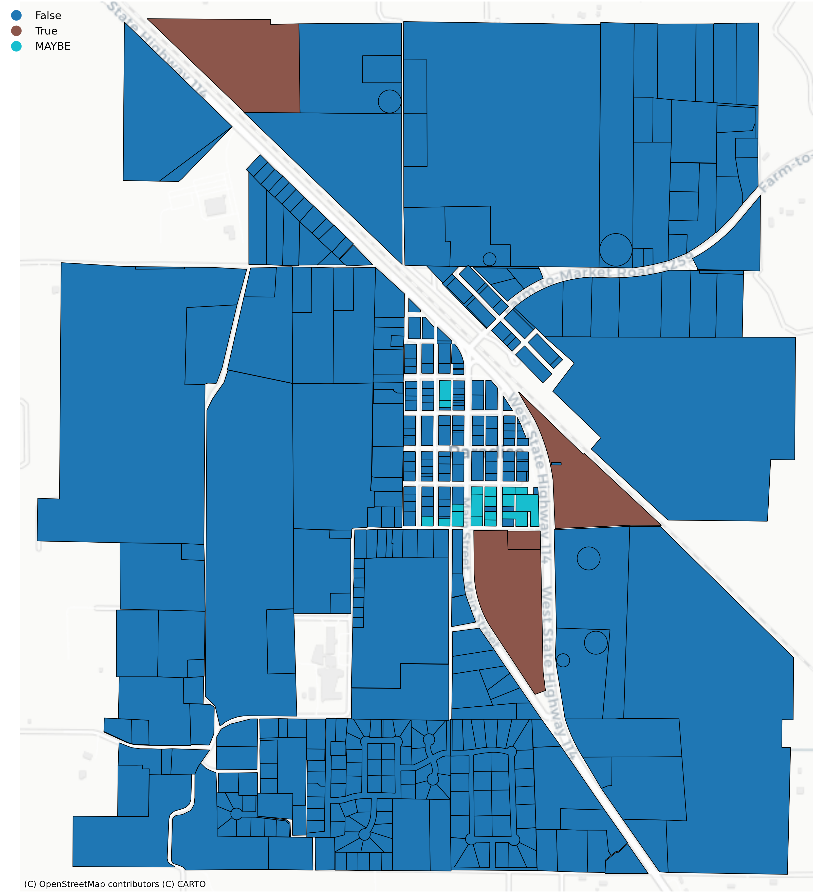
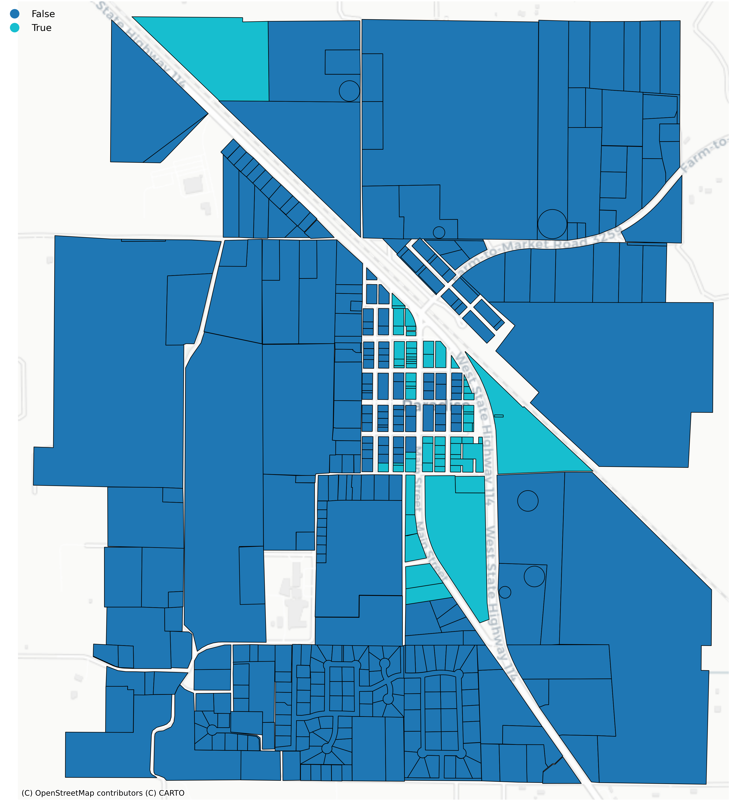
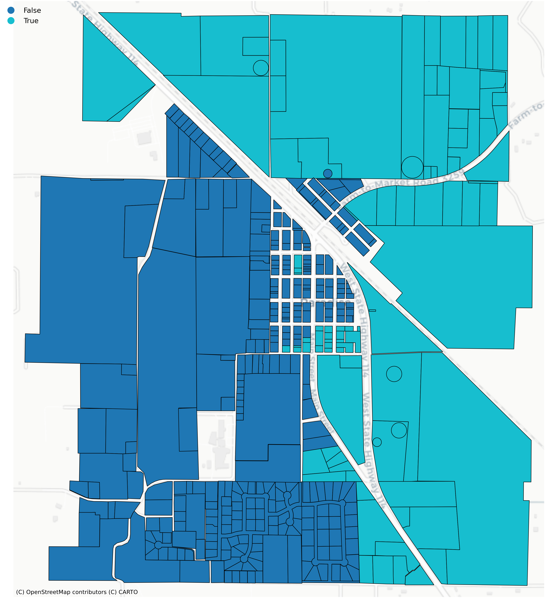
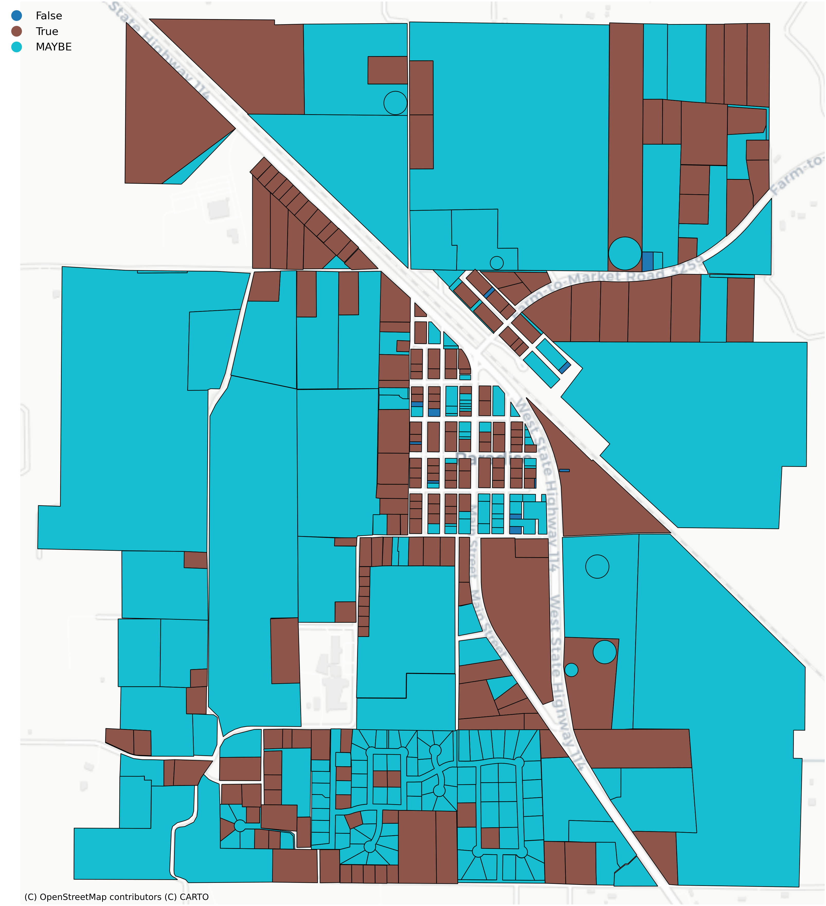

<!-- README.md is generated from README.Rmd. Please edit that file -->

# zonepy

<!-- badges: start -->

<!-- badges: end -->

Analyze the housing capacity of cities using Open Zoning Feed
Specification (OZFS) data.

The main function of zonepy is `zp_run_zoning_checks()` which reads in an
OZFS `.bldg`, `.parcel`, and `.zoning` file. It calculates the zoning
requirements for each parcel, checks them against the building
characteristics, and returns a data frame with a row for each parcel and
an “allowed” column containing one of three possible values.

- `TRUE`: The building is allowed on the parcel

- `FALSE`: The building is not allowed on the parcel

- `MAYBE`: The building might be allowed on the parcel depending on
  conditions that are not yet possible to express in OZFS.

## Installation

You can install the development version of zonepy from
[zonepy](https://github.com/vibe-lab-gsd/zonepy) with:

``` r
# install.packages zonepy for your loacl computer
!pip install git+https://github.com/vibe-lab-gsd/zonepy.git
# uninstall.packages zonepy from your local computer
!pip uninstall zonepy -y
```

## Example

This is a basic example of finding which parcels in Paradise, TX allow a
duplex with a gross floor area of 3200 square feet and a height of 45
feet. Small OZFS files accessible through the package will be used in
the example.

``` r
import geopandas as gpd
import pandas as pd
import numpy as np
import matplotlib.pyplot as plt
import seaborn as sns
import os
import json
import glob

from shapely.geometry import Point
from shapely.geometry import box
from shapely.geometry import mapping

from joblib import Parallel, delayed
from tqdm import tqdm

# input my libraries
from zonepy import zp_get_crs
from zonepy import zp_find_district_idx
from zonepy import zp_read_dist
from zonepy import zp_read_pcl
from zonepy import zp_read_bldg
from zonepy import zp_get_dist_def
from zonepy import zp_get_parcel_dim
from zonepy import zp_get_parcel_geo
from zonepy import zp_get_unit_info
from zonepy import zp_get_variables
from zonepy import zp_get_zoning_req
from zonepy import zp_check_unit
from zonepy import zp_check_res_type
from zonepy import zp_check_constraints
from zonepy import zp_add_setbacks
from zonepy import zp_get_buildable_area
from zonepy import zp_check_fit
from zonepy import possible_checks
from zonepy import zp_run_zoning_checks

bldg_path <- zr_example_files("2_fam.bldg")
parcel_path <- zr_example_files("Paradise.parcel")
zoning_path <- zr_example_files("Paradise.zoning")
```

We can then put each of the files into the `zr_run_zoning_checks()`
function and assign the result to a variable called zoning_checks.

``` r
zoning_checks = zp_run_zoning_checks(bldg_file = bldg_path,, 
                                     parcel_files = parcel_path,,
                                     zoning_files = zoning_path
                                     checks=possible_checks)

#> ___data_prep___ 3.1s
#> 
#> ___cross_no_dist_check___ 0.0s, kept 421 parcels
#> 
#> ___get_zoning_req___ 1.1s
#> 
#> ___initial_checks___ 0.9s
#> 
#> ___side_label_check___ 0.0s
#> 
#> ___bldg_fit___ 0.1s
#> 
#> _____summary_____
#> total runtime: 5.3s
#> 4/421 parcels allow the building; 18/421 maybe allow
```

The result of the function is a simple features data frame with the
following columns: “parcel_id”, “allowed”, “reason”, “geometry.” Note
that the geometry is the centroid of the parcel.

``` r
zoning_checks
#> Simple feature collection with 5 features and 5 fields
#> Geometry type: POINT
#> Dimension:     XY
#> Bounding box:  xmin: -97.69917 ymin: 33.1448 xmax: -97.69153 ymax: 33.15607
#> Geodetic CRS:  WGS 84
#>                              parcel_id	muni_name	dist_abbr	allowed	   reason	                         geometry
#> 0	Wise_County_combined_parcel_1	    [Paradise]	[R-1]	    False	   res_type,height	                 POINT (675072.137 2164502.614)
#> 1	Wise_County_combined_parcel_10300	[Paradise]	[R-1]   	False	   res_type,height	                 POINT (675197.462 2165448.674)
#> 2	Wise_County_combined_parcel_10450	[Paradise]	[R-1]   	False	   res_type,height	                 POINT (675176.011 2164198.798)
#> 3	Wise_County_combined_parcel_10451	[Paradise]	[R-1]	    False	   res_type,height,unit_density	     POINT (675417.164 2164291.103)
#> 4	Wise_County_combined_parcel_10452	[Paradise]	[R-1]   	False	   res_type,height,unit_density	     POINT (675419.094 2164443.651)
```

The graph below is a visualization of the results.


It appears the map of this duplex allowed situation in the Paradise
parcels. To look further into the reasons, we can specify the checks we
want to be run and look at those results. Since land use regulations are
often a distinguishing factor in allowing a building on a parcel, only
the res_type check will be run in this next example. We will also put
`print_checkpoints = FALSE` because we don’t really need it to tell us
when it is done with the different parts of the function.

``` r
zoning_checks == zp_run_zoning_checks(bldg_file = bldg_path,
                                      parcel_files = parcel_path,
                                      zoning_files = zoning_path, 
                                      checks = "res_type",
                                      print_checkpoints = FALSE)
#> total runtime: 1.1 sec
```

Now we can see that only a few of the parcels are in a district that
allows buildings with two units. It makes sense why there were only a
few parcels in the previous check that might have allowed the building.


Here are a few other constraint checks to visualize.

Height Check

``` r
zoning_checks <- zp_run_zoning_checks(bldg_file = bldg_path,
                                      parcel_files = parcel_path,
                                      zoning_files = zoning_path, 
                                      checks = "height",
                                      print_checkpoints = FALSE)
#> total runtime: 1.2 sec
```



Building Fit Check

``` r
zoning_checks <- zp_run_zoning_checks(bldg_file = bldg_path,
                                      parcel_files = parcel_path,
                                      zoning_files = zoning_path, 
                                      checks = "bldg_fit",
                                      print_checkpoints = FALSE)
#> total runtime: 13.1 sec
```



Many of the “MAYBE” values attached to the bldg_fit constraint represent
parcels that didn’t have labeled sides. Without labeled sides, a proper
buildable area could not be calculated, and the building fit check was
skipped.

#### Detailed Check

In addition to the usual data frame that is returned, setting
`detailed_check = TRUE` returns the data frame with additional columns
for every check that took place (Note this requires more processing time
as the code does not skip consecutive checks if a previous check yields
FALSE).

``` r
zoning_checks <- zp_run_zoning_checks(bldg_file = bldg_path,
                                      parcel_files = parcel_path,
                                      zoning_files = zoning_path,
                                      detailed_check = TRUE)
#>___data_prep___ 5.8s
#>
#>___cross_no_dist_check___ 0.0s, kept 421 parcels
#>
#>___get_zoning_req___ 1.2s
#>
#>___initial_checks___ 0.9s
#>
#>___side_label_check___ 0.0s
#>
#>___bldg_fit___ 1.2s
#>
#>_____summary_____
#>total runtime: 9.1s
#>4/421 parcels allow the building; 18/421 maybe allow
```

With these added columns, we can look more closely at why the building
does not fit in most of the parcels.

``` r
And then we can summarize a table to have a look at check situation in each constraint.
```
| constraint_check | True | MAYBE | False | True_pct | MAYBE_pct | False_pct |
|:-----------------|------|-------|-------|----------|-----------|----------:|	
|res_type	       |    65|      0|	   356|	    15.4%|	     0.0%|	    84.6%|
|unit_size	       |   421|      0|	     0|	   100.0%|	     0.0%|	     0.0%|
|bldg_fit	       |   205|     35|	    11|	    81.7%|	    13.9%|	     4.4%|
|overlay	       |     0|      0|	     0|	   100.0%|	     0.0%|	     0.0%|
|far	           |   421|      0|	     0|	   100.0%|	     0.0%|	     0.0%|
|fl_area	       |   421|      0|	     0|	   100.0%|	     0.0%|	     0.0%|
|fl_area_first	   |   421|      0|	     0|	   100.0%|	     0.0%|	     0.0%|
|fl_area_top	   |   421|      0|	     0|	   100.0%|	     0.0%|	     0.0%|
|footprint  	   |   421|      0|	     0|	   100.0%|	     0.0%|	     0.0%|
|height  	       |    97|      0|	   324|	   100.0%|	     0.0%|	    77.0%|
|height_eave  	   |   421|      0|	     0|	   100.0%|	     0.0%|	     0.0%|
|lot_cov_bldg  	   |   418|      0|	     3|	    99.3%|	     0.0%|	     0.7%|
|lot_size  	       |   365|      0|	    56|	    86.7%|	     0.0%|	    13.3%|
|parking_enclosed  |   421|      0|	     0|	   100.0%|	     0.0%|	     0.0%|
|floors            |   421|      0|	     0|	   100.0%|	     0.0%|	     0.0%|
|unit_0bed         |   421|      0|	     0|	   100.0%|	     0.0%|	     0.0%|
|unit_1bed         |   421|      0|	     0|	   100.0%|	     0.0%|	     0.0%|
|unit_2bed         |   421|      0|	     0|	   100.0%|	     0.0%|	     0.0%|
|unit_3bed         |   421|      0|	     0|	   100.0%|	     0.0%|	     0.0%|
|unit_4bed         |   421|      0|	     0|	   100.0%|	     0.0%|	     0.0%|
|unit_density      |   297|      0|	   124|	    70.5%|	     0.0%|	    29.5%|
|unit_pct_0bed     |   421|      0|	     0|	   100.0%|	     0.0%|	     0.0%|
|unit_pct_1bed     |   421|      0|	     0|	   100.0%|	     0.0%|	     0.0%|
|unit_pct_2bed     |   421|      0|	     0|	   100.0%|	     0.0%|	     0.0%|
|unit_pct_3bed     |   421|      0|	     0|	   100.0%|	     0.0%|	     0.0%|
|unit_pct_4bed     |   421|      0|	     0|	   100.0%|	     0.0%|	     0.0%|
|total_units       |   421|      0|	     0|	   100.0%|	     0.0%|	     0.0%|
|unit_size_avg     |   421|      0|	     0|	   100.0%|	     0.0%|	     0.0%|

It appears the res_type constraint is the most restrictive for the given building.

## Inside the zp_run_zoning_checks()

Most of the functions in zonepy were created for
`zp_run_zoning_checks()`, but they can be used by themselves if desired.
Below are some of the main variables that the different zonepy functions
take in.

- **bldg_data:** The `.bldg` file read in as a list using
  `zp_read_bldg`

- **parcel_data:** The `.parcel` file read in as a geopandas using
  `zp_read_pcl`

- **parcel_dims:** Created with the `zp_get_parcel_dims()` function. A
  simple features data frame with all the centroid and dimensional data
  from the `.parcel` file. It contains one row per parcel.

- **parcel_geo:** Created with the `zp_get_parcel_geo()` function. A
  simple features data frame containing the geometry of each parcel side
  without the centroid or dimensional data.

- **zoning_data:** The data in the `.zoning` file read in as a simple
  features dataframe using `zp_read_dist`.

- **district_data:** One row of the zoning_data data frame representing
  a unique district, which can be read by `zp_get_dist_def`.
